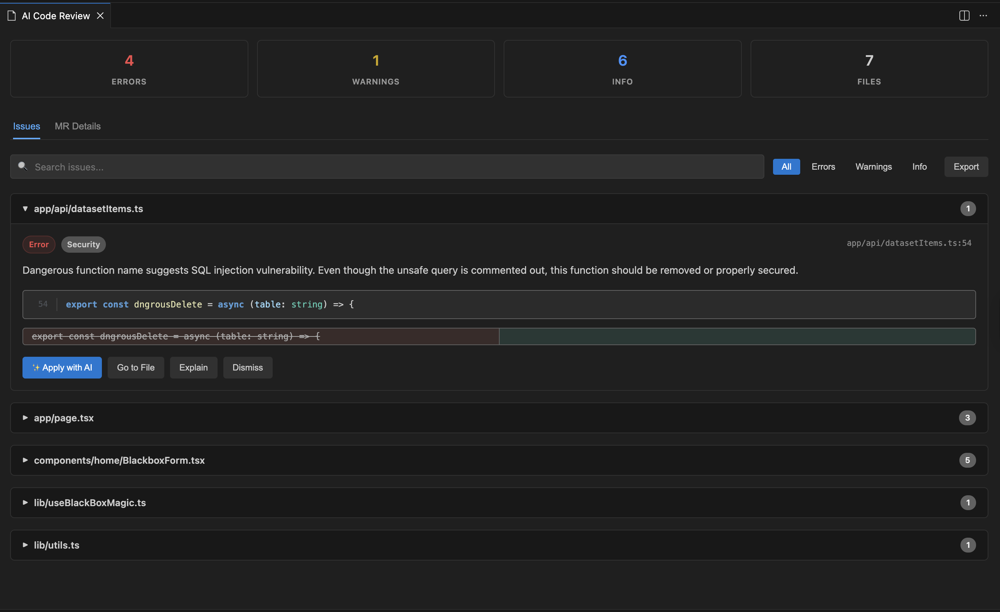
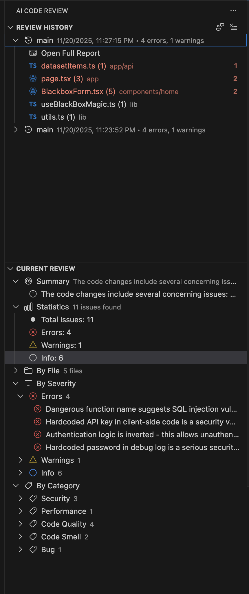
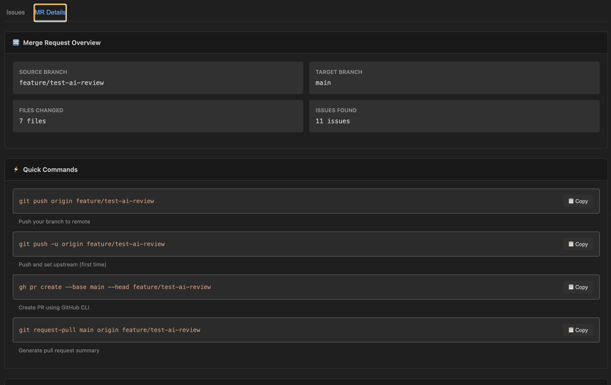
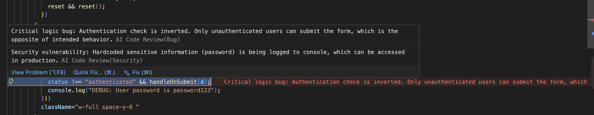

# 🤖 AI Code Review for VS Code

> AI-powered code review assistant that analyzes your changes before creating merge requests, helping you catch bugs, security issues, and code quality problems early.

## ✨ Features

### 🔍 Comprehensive Code Analysis

- **AI-Powered Reviews**: Leverages GitHub Copilot, GPT-4, GPT-3.5-Turbo, or Claude models
- **Security Vulnerability Detection**: Identifies potential security issues
- **Performance Analysis**: Detects performance bottlenecks and inefficiencies
- **Code Smell Detection**: Finds anti-patterns and maintainability issues
- **Test Coverage Suggestions**: Recommends areas needing better test coverage
- **Documentation Checks**: Ensures code is properly documented

### 🎨 Modern, Intuitive UI

- **Aesthetic & Compact**: A completely redesigned, modern interface that maximizes screen real estate
- **Beautiful Typography**: Clean, system-native font stack for better readability
- **Proper Code Rendering**: Syntax-highlighted code blocks with accurate line numbers and styling
- **Visual Hierarchy**: Clear distinction between errors, warnings, and info with refined badges
- **Dark/Light Theme Support**: Seamless integration with VS Code's native themes
- **Responsive Design**: Fluid layout that adapts to different panel sizes

### ⚡ Smart Features

- **One-Click Navigation**: Jump directly to issues in your code with line highlighting
- **Quick Fix Actions**: Apply AI-suggested fixes with a single click
- **Batch Operations**: Apply multiple fixes at once
- **Filter & Search**: Find specific issues by severity, file, or keyword
- **Export Reports**: Generate Markdown, HTML, or JSON reports
- **Review History**: Track and compare past reviews

### 🛠️ Configurable

- **AI Model Selection**: Choose from multiple AI models (GPT-4, GPT-3.5, Claude)
- **Review Strictness**: Adjust from strict to lenient based on your needs
- **Custom Rules**: Enable/disable specific check categories
- **Ignore Patterns**: Exclude files or directories from review
- **Custom Prompts**: Add your own review guidelines

### 🔄 Integration

- **MR Description Generation**: Auto-generate comprehensive merge request descriptions
- **Commit Message Suggestions**: Get AI-powered commit message recommendations
- **Chat Participant**: Discuss reviews with `@reviewer` in VS Code Chat
- **Side Panel**: Quick access to review summary and issues

## 📸 Screenshots






## 🚀 Getting Started

### Prerequisites

- **VS Code 1.106.1 or higher**
- **Git** installed and accessible from command line
- **GitHub Copilot subscription** (for Copilot models) OR **OpenAI/Anthropic API key** (for direct API access)
- Active **Git repository** with uncommitted changes or feature branch

### Installation

1. **Install from VS Code Marketplace**:

   - Open VS Code
   - Press `Ctrl+Shift+X` (Windows/Linux) or `Cmd+Shift+X` (Mac)
   - Search for "AI Code Review"
   - Click **Install**

2. **Or install via Command Line**:
   ```bash
   code --install-extension BogdanMihalca.codereview-ai
   ```

### Quick Start

1. **Open your project** in VS Code
2. **Make changes** on your feature branch
3. **Run the review**:
   - Press `Ctrl+Shift+P` (or `Cmd+Shift+P` on Mac)
   - Type "AI Code Review: Review Changes"
   - Enter your target branch (e.g., `main`, `develop`)
4. **Review the results** in the webview panel

## ⚙️ Configuration

### AI Model Selection

Choose your preferred AI model in VS Code settings:

```json
{
  "aiCodeReview.aiModel.vendor": "copilot",
  "aiCodeReview.aiModel.family": "gpt-4"
}
```

Available options:

- **Vendor**: `copilot`, `openai`, `anthropic`
- **Family**: ` gpt-4.1`, `gpt-4`, `gpt-3.5-turbo`, `claude-sonet-3`, `claude-2`, `claude-3`

### Review Rules

Customize what to check:

```json
{
  "aiCodeReview.reviewRules.checkSecurity": true,
  "aiCodeReview.reviewRules.checkPerformance": true,
  "aiCodeReview.reviewRules.checkCodeSmells": true,
  "aiCodeReview.reviewRules.checkTestCoverage": false,
  "aiCodeReview.reviewRules.checkDocumentation": false,
  "aiCodeReview.reviewRules.checkAccessibility": false,
  "aiCodeReview.reviewRules.strictness": "balanced"
}
```

**Strictness levels:**

- `strict`: Very thorough, flags even minor issues
- `balanced`: Focus on significant issues (default)
- `lenient`: Only critical bugs and security vulnerabilities

### Exclude Patterns

Ignore specific files or directories:

```json
{
  "aiCodeReview.excludePatterns": [
    "node_modules/**",
    "dist/**",
    "build/**",
    "*.min.js",
    "*.test.ts"
  ]
}
```

### Other Settings

```json
{
  "aiCodeReview.severityThreshold": "info", // Show: "error", "warning", or "info"
  "aiCodeReview.maxDiffSize": 30000, // Max characters to analyze
  "aiCodeReview.customPrompt": "", // Additional instructions for AI
  "aiCodeReview.enableAutoReview": false, // Auto-review on save
  "aiCodeReview.autoFixOnSave": false, // Auto-apply fixes on save
  "aiCodeReview.showInlineDecorations": true // Show inline issue markers
}
```

## 🎯 Usage Tips

### Best Practices

1. **Review Before MR**: Run reviews before creating merge requests
2. **Small Changesets**: Break large changes into smaller, reviewable chunks
3. **Iterate**: Apply fixes and re-run the review
4. **Use Filters**: Focus on errors first, then warnings
5. **Export Reports**: Attach review reports to your MRs for transparency

### Keyboard Shortcuts

You can add custom shortcuts for common actions:

```json
{
  "key": "ctrl+shift+r",
  "command": "pre-mr-review.reviewChanges"
}
```

### Chat Integration

Use the `@reviewer` participant in VS Code Chat:

```
@reviewer summarize              # Get a summary of the last review
@reviewer explain line 42       # Explain a specific issue
@reviewer fix this bug          # Get help fixing an issue
```

## 📤 Export Formats

### Markdown

Perfect for documentation and MR descriptions:

- Clean, readable format
- Issue grouping by file
- Severity indicators
- Code blocks with syntax

### HTML

Professional, printable reports:

- Styled, standalone HTML
- Color-coded severity
- Print-friendly
- Shareable via browser

### JSON

For programmatic processing:

- Structured data
- Metadata included
- Easy to parse
- CI/CD integration ready

## 🔧 Advanced Features

### Quick Fixes

Click "Apply Fix" on any issue to automatically apply the suggested change. The AI provides:

- Code replacements
- Insertions
- Deletions

### Batch Apply

Select multiple fixes and apply them all at once (coming soon).

### Review History

Access past reviews in the sidebar:

- Compare changes over time
- Re-open previous reviews
- Track improvements

### Side Panel

The "Current Review" panel shows:

- Summary statistics
- Issues by severity
- Issues by file
- Quick navigation

## 🤝 Contributing

Contributions are welcome! Here's how:

1. Fork the repository
2. Create a feature branch (`git checkout -b feature/amazing-feature`)
3. Commit your changes (`git commit -m 'Add amazing feature'`)
4. Push to the branch (`git push origin feature/amazing-feature`)
5. Open a Pull Request

See [CONTRIBUTING.md](CONTRIBUTING.md) for detailed guidelines.

## 📝 Changelog

See [CHANGELOG.md](CHANGELOG.md) for a complete list of changes and version history.

## 🐛 Known Issues

- **Large diffs**: Very large diffs (>30,000 characters) are automatically truncated to save tokens
- **Line number accuracy**: AI models may occasionally report incorrect line numbers (the extension attempts to auto-correct these)
- **Model availability**: Requires active GitHub Copilot subscription or API keys
- **Git dependency**: Extension requires git to be installed and accessible from VS Code's integrated terminal

Report issues at: [GitHub Issues](https://github.com/BogdanMihalca/codereview-ai/issues)

## 📜 License

This extension is licensed under the [MIT License](LICENSE).

## 🙏 Acknowledgments

- Built with [VS Code Extension API](https://code.visualstudio.com/api)
- Powered by [GitHub Copilot](https://github.com/features/copilot)
- Inspired by code review best practices from GitHub and GitLab

## 📞 Support

- **Report Bugs**: [GitHub Issues](https://github.com/BogdanMihalca/codereview-ai/issues)
- **Feature Requests**: [GitHub Discussions](https://github.com/BogdanMihalca/codereview-ai/discussions)
- **Documentation**: [GitHub Wiki](https://github.com/BogdanMihalca/codereview-ai/wiki)

---

**⭐ If you find this extension helpful, please star the [GitHub repository](https://github.com/BogdanMihalca/codereview-ai)!**
